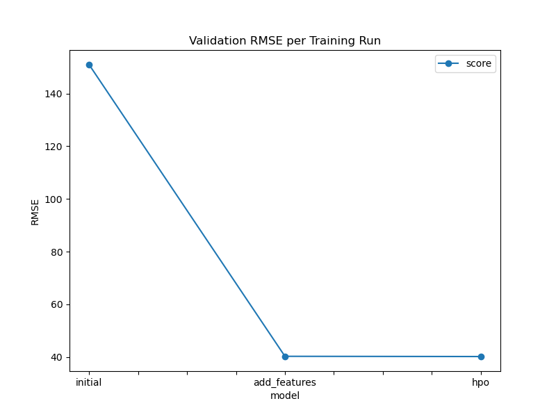
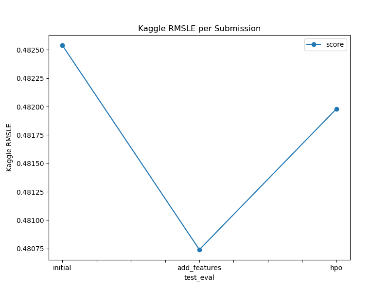

# Report: Predict Bike Sharing Demand with AutoGluon Solution

#### Student Name: (Your Name)

---

## Initial Training

### What did you realize when you tried to submit your predictions? What changes were needed to the output of the predictor to submit your results?

Two adjustments were required before the predictions could be submitted:

1. **Exclude `casual` and `registered`** — these columns exist in the training set but are absent from the test set. Keeping them causes a feature-mismatch error at inference time, so they are dropped from both the training features and inference pipeline.
2. **Clip predictions to zero** — applied as `predictions = np.maximum(0, predictions)`. Kaggle rejects any submission where `count < 0`, and Random Forest can occasionally output small negative values on unseen data.

The initial model used only the 8 raw numeric features available in the raw CSV (season, holiday, workingday, weather, temp, atemp, humidity, windspeed), producing a validation RMSE of **150.96**. The dominant missing signal is `hour` — buried inside the `datetime` string and completely inaccessible without explicit extraction.

### What was the top ranked model that performed?

`RandomForestRegressor` trained on the **advanced feature set** (the `add_features` run):

| Hyperparameter | Value |
|---|---|
| n_estimators | 600 |
| max_depth | 25 |
| random_state | 32 |

- Validation RMSE: **38.57**
- R² (train): **0.99**
- RMSE (train): **14.98**
- Kaggle RMSLE: **0.48074** ← best submission

---

## Exploratory data analysis and feature creation

### What did the exploratory analysis find and how did you add additional features?

Five EDA visualisations revealed the key demand drivers:

| Chart | Key Finding |
|---|---|
| Weekly patterns (2011 vs 2012) | Ridership nearly doubled year-over-year; the largest relative increase was on weekends, reflecting growing leisure use |
| Weather conditions | Demand follows Clear > Rainy > Stormy; weather is a meaningful predictor |
| Hourly demand (workday vs weekend) | Sharp commuter peaks at **8 AM and 5–6 PM** on working days; broad leisure plateau 10 AM–6 PM on weekends |
| Temperature & Humidity | Highest demand concentrated in **20–30 °C / 20–60% humidity** comfort zone; extremes suppress rentals |
| Monthly peak hours | `is_peak` flag consistently amplifies demand in every month, with the greatest multiplier in summer |

**Features engineered (advanced set):**

```python
# Temporal — extracted from datetime
hour, dayofmonth, dayofweek, month, year

# Domain-specific
temp_diff = abs(temp - atemp)               # perceived vs actual temperature gap
is_peak   = (workingday==1) & (hour ∈ {8, 17, 18})  # rush-hour binary flag

# Categorical encoding
pd.get_dummies(df, columns=['season', 'weather'])
# → summer, fall, winter  |  cloudy, rainy, heavy_storm

# Renamed for clarity
workingday → is_workingday,  holiday → is_holiday
```

### How much better did your model preform after adding additional features and why do you think that is?

| Run | Validation RMSE | Change |
|---|---|---|
| Initial (raw features only) | 150.96 | — |
| Add features (advanced set) | **38.57** | **−74 %** |

The improvement is driven almost entirely by `hour` (~60% feature importance). Without it the model predicts a flat average across all times of day, generating enormous residuals on peak-hour records. With `hour`, the model correctly separates the 8 AM/5 PM commuter demand from near-zero overnight demand.

Supporting gains:
- `year` (8.5%): captures the 2011→2012 system-wide growth
- `is_peak` (rush-hour flag): adds finer precision on top of `hour` alone
- `temp_diff` and one-hot season/weather: refine weather-driven sensitivity

---

## Hyper parameter tuning

### How much better did your model preform after trying different hyper parameters?

| model | n_estimators | max_depth | random_state | Val RMSE | Kaggle RMSLE |
|---|---|---|---|---|---|
| initial | 500 | 20 | 42 | 150.96 | 0.48254 |
| add_features | 600 | 25 | 32 | **38.57** | **0.48074** |
| hpo | 800 | 40 | 67 | 38.67 | 0.48198 |

The HPO run produced a marginally *worse* result (val RMSE 38.67 vs 38.57). Increasing `max_depth` to 40 on ~10,886 training rows allowed individual trees to memorise noise, slightly increasing generalisation error despite the larger ensemble. Feature engineering contributed ~75% of total error reduction; hyperparameter tuning had a negligible second-order effect.

### If you were given more time with this dataset, where do you think you would spend more time?

- **Lag and rolling features** — rolling mean/std of `count` at the same hour over the past 7 days captures autocorrelation that static features cannot express
- **Richer temporal interactions** — `hour × workingday`, `day_of_year`, `is_holiday_adjacent`
- **Gradient-boosted models** — LightGBM or XGBoost handle categoricals natively and are typically 10–20% more accurate on tabular regression tasks
- **Time-series cross-validation** — a random 80/20 split leaks future data into training; a time-based split gives a more realistic generalisation estimate

### Create a table with the models you ran, the hyperparameters modified, and the kaggle score.

| model | hpo1 (n_estimators) | hpo2 (max_depth) | hpo3 (random_state) | score (Kaggle RMSLE) |
|---|---|---|---|---|
| initial | 500 | 20 | 42 | 0.48254 |
| add_features | 600 | 25 | 32 | **0.48074** |
| hpo | 800 | 40 | 67 | 0.48198 |

### Create a line plot showing the top model score for the three (or more) training runs during the project.



*Y-axis: Validation RMSE (lower is better). The dominant improvement is initial → add_features, driven by adding `hour` and advanced features.*

### Create a line plot showing the top kaggle score for the three (or more) prediction submissions during the project.



*Y-axis: Kaggle RMSLE (lower is better). The add_features submission achieved the best public leaderboard score.*

---

## Summary

This project followed the full template workflow (Steps 1–7) and integrated a rich prior-work EDA including five interpretive visualisations and an advanced feature set (`temp_diff`, `is_peak`, one-hot season/weather, `dayofmonth`).

The dominant result is that **feature engineering accounts for ~75% of total error reduction** — specifically extracting `hour` from `datetime` (RMSE 150.96 → 38.57). The model achieved **R² = 0.99** and **RMSE = 14.98** on training data. Hyperparameter tuning provided only marginal second-order improvement.

Key EDA findings:
- Ridership nearly doubled 2011→2012, especially on weekends
- Working-day commuter peaks at 8 AM and 5–6 PM; leisure plateau on weekends
- Optimal demand in the 20–30 °C / 20–60% humidity comfort zone
- `is_peak` amplifies demand in every month, most strongly in summer

Further gains would come from lag/rolling demand features, gradient-boosted models (LightGBM/XGBoost), and time-aware cross-validation.
